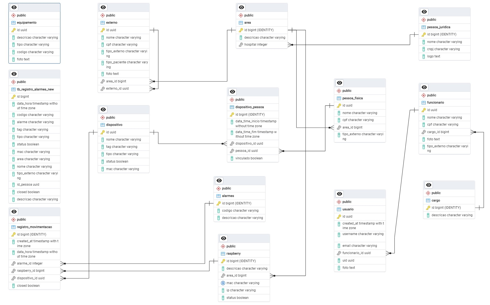

# projeto_ble_renew

Controle de fluxo de pessoas e equipamentos em hospital   

<h2 align="center">
  
   
    


   

</h2>

> [!NOTE]
> 📌Projeto Flutter de Controle de fluxo de pessoas e equipamentos em hospital   
> **Codelink 2024**

## ✔️ Técnicas e tecnologias utilizadas

- ``Flutter 3.19.1``
- ``Dart 3.3.0``
- ``Android Studio/Visual Studio Code``
- ``Supabase(Postgres)``
<p align="center">
    
</p>

## TO DO

- [x] Terminar hero da pesquisa    
- [ ] Verificar rotas ao voltar (Scan Blue)   
- [ ] Trigger para dispositivo ficar true ao vincular
- [ ] Dispositivos ativos não devem aparecer na lista de vincular
- [ ] Criar opção de DESVINCULAR dispositivo  
- [ ] Regras de negócio para usuário e dispositivo único  
- [ ] Mapa com RFID ou lista   
- [ ] Ajustar layout para desktop
- [ ] Verificar as deleções   
- [ ] Vincular equipamento area   
- [ ] Quando paciente for dependente vincular externo
- [ ] Cadastro de usuario no auth 
- [ ] trigger para update em pessoa_fisica e delete
- [ ] Atualizar documentação


## 📁 Acesso ao projeto
Você pode acessar os arquivos do projeto clicando [aqui](https://github.com/ericamila/projeto_ble_renew/tree/main/lib).

## Banco de Dados

### [Supabase](https://supabase.com/)
>https://pub.dev/packages/supabase_flutter

#### Tabela alarme
````sql
CREATE TABLE public.alarmes (
    id bigint GENERATED BY DEFAULT AS IDENTITY,
    codigo CHARACTER varying NULL,
    descricao CHARACTER varying NULL,
    CONSTRAINT alarmes_pkey PRIMARY KEY (id)
) TABLESPACE pg_default;
````

#### Tabela area
````sql
CREATE TABLE public.area (
    id bigint GENERATED BY DEFAULT AS IDENTITY,
    descricao CHARACTER varying NULL,
    hospital integer NULL,
    CONSTRAINT area_pkey PRIMARY KEY (id)
) TABLESPACE pg_default;
````

#### Tabela cargo
````sql
CREATE TABLE public.cargo (
    id bigint GENERATED BY DEFAULT AS IDENTITY,
    descricao CHARACTER varying NULL,
    CONSTRAINT cargo_pkey PRIMARY KEY (id)
) TABLESPACE pg_default;
````

#### Tabela dispositivo
````sql
CREATE TABLE public.dispositivo (
    id bigint GENERATED BY DEFAULT AS IDENTITY,
    tag CHARACTER varying NULL,
    tipo CHARACTER varying NULL,
    "MAC" CHARACTER varying NULL,
    status boolean NULL DEFAULT FALSE,
    CONSTRAINT dispositivo_pkey PRIMARY KEY (id)
) TABLESPACE pg_default;
````

#### Tabela dispositivo_pessoa
````sql
CREATE TABLE public.dispositivo_pessoa (
    id bigint GENERATED BY DEFAULT AS IDENTITY,
    data_time_inicio timestamp WITHOUT TIME ZONE NULL DEFAULT now(),
    data_time_fim timestamp WITHOUT TIME ZONE NULL,
    dispositivo_id bigint NULL,
    pessoa_id bigint NULL,
    CONSTRAINT dispositivo_usuario_pkey PRIMARY KEY (id), 
    CONSTRAINT public_dispositivo_usuario_dispositivo_id_fkey
    FOREIGN KEY (dispositivo_id) REFERENCES dispositivo (id),
    CONSTRAINT public_dispositivo_usuario_usuario_id_fkey
    FOREIGN KEY (pessoa_id) REFERENCES pessoa_fisica (id)
) TABLESPACE pg_default;
````

#### Tabela externo
````sql
CREATE TABLE public.externo(
    id bigint GENERATED BY DEFAULT AS IDENTITY,
    tipo CHARACTER varying NULL,
    CONSTRAINT externo_pkey PRIMARY KEY (id), CONSTRAINT public_externo_id_fkey
    FOREIGN KEY (id) REFERENCES pessoa_fisica (id) ON UPDATE CASCADE ON DELETE CASCADE
) TABLESPACE pg_default;
````

#### Tabela funcionario
````sql
CREATE TABLE public.funcionario (
    id bigint GENERATED BY DEFAULT AS IDENTITY,
    tipo_funcionario CHARACTER varying NULL,
    cargo_id bigint NULL,
    CONSTRAINT funcionario_pkey PRIMARY KEY (id), 
    CONSTRAINT public_funcionario_cargo_id_fkey
    FOREIGN KEY (cargo_id) REFERENCES cargo (id),
    CONSTRAINT public_funcionario_id_fkey
    FOREIGN KEY (id) REFERENCES pessoa_fisica (id)
) TABLESPACE pg_default;
````

#### Tabela pessoa
````sql
CREATE TABLE public.pessoa (
    id bigint GENERATED BY DEFAULT AS IDENTITY,
    created_at timestamp WITH TIME ZONE NOT NULL DEFAULT now(),
    nome CHARACTER varying NULL,
    CONSTRAINT pessoa_pkey PRIMARY KEY (id)
) TABLESPACE pg_default;
````

#### Tabela pessoa_fisica
````sql
CREATE TABLE public.pessoa_fisica(
    id bigint GENERATED BY DEFAULT AS IDENTITY,
    created_at timestamp WITH TIME ZONE NOT NULL DEFAULT now(),
    cpf CHARACTER varying NULL,
    CONSTRAINT usuario_pkey PRIMARY KEY (id), 
    CONSTRAINT public_pessoa_fisica_id_fkey
    FOREIGN KEY (id) REFERENCES pessoa (id) ON UPDATE CASCADE ON DELETE CASCADE
) TABLESPACE pg_default;
````

#### Tabela pessoa_juridica
````sql
CREATE TABLE public.pessoa_juridica(
    id bigint NOT NULL,
    cnpj CHARACTER varying NULL,
    CONSTRAINT pessoa_juridica_pkey PRIMARY KEY (id), 
    CONSTRAINT pessoa_juridica_id_key UNIQUE (id), 
    CONSTRAINT public_pessoa_juridica_id_fkey
    FOREIGN KEY (id) REFERENCES pessoa (id) ON UPDATE CASCADE ON DELETE CASCADE
) TABLESPACE pg_default;
````

#### Tabela raspberry
````sql
CREATE TABLE public.raspberry (
    id bigint GENERATED BY DEFAULT AS IDENTITY,
    descricao CHARACTER varying NULL,
    area_id bigint NULL,
    "MAC" CHARACTER varying NULL,
    "IP" CHARACTER varying NULL,
    status boolean NULL DEFAULT TRUE,
    CONSTRAINT raspberry_pkey PRIMARY KEY (id), 
    CONSTRAINT raspberry_MAC_key UNIQUE ("MAC"), 
    CONSTRAINT public_raspberry_area_id_fkey
    FOREIGN KEY (area_id) REFERENCES area(id)
) TABLESPACE pg_default;
````

#### Tabela registro_movimentacao
````sql
CREATE TABLE public.registro_movimentacao (
    id bigint GENERATED BY DEFAULT AS IDENTITY,
    created_at timestamp WITH TIME ZONE NOT NULL DEFAULT now(),
    data_hora timestamp WITHOUT TIME ZONE NULL,
    alarme_id integer NULL,
    raspberry_id bigint NULL,
    dispositivo_id integer NULL,
    CONSTRAINT registro_movimentacao_pkey PRIMARY KEY (id), 
    CONSTRAINT public_registro_movimentacao_alarme_id_fkey
    FOREIGN KEY (alarme_id) REFERENCES alarmes (id),
    CONSTRAINT public_registro_movimentacao_dispositivo_id_fkey
    FOREIGN KEY (dispositivo_id) REFERENCES dispositivo (id),
    CONSTRAINT public_registro_movimentacao_raspberry_id_fkey
    FOREIGN KEY (raspberry_id) REFERENCES raspberry (id)
) TABLESPACE pg_default;
````

#### Tabela usuario
````sql
CREATE TABLE public.usuario(
    id bigint GENERATED BY DEFAULT AS IDENTITY,
    email CHARACTER varying NULL,
    senha CHARACTER varying NULL,
    CONSTRAINT usuario_pkey1 PRIMARY KEY (id), 
    CONSTRAINT public_usuario_id_fkey
    FOREIGN KEY (id) REFERENCES pessoa_fisica (id) ON UPDATE CASCADE ON DELETE CASCADE
) TABLESPACE pg_default;
````

#### Visão vw_dispositivos_usuarios
````sql
CREATE VIEW public.vw_dispositivos_usuarios AS
SELECT UPPER(pessoa_fisica.nome) AS nome,
    dispositivo.mac,
    dispositivo.tipo
FROM dispositivo_pessoa
JOIN pessoa_fisica ON dispositivo_pessoa.pessoa_id = pessoa_fisica.id
JOIN dispositivo ON dispositivo_pessoa.dispositivo_id = dispositivo.id;
````

#### Triggers
````sql
CREATE TRIGGER insert_person_externo
AFTER INSERT ON externo
FOR EACH ROW
EXECUTE FUNCTION update_pessoa_fisica();
````
#### Functions
````sql
CREATE FUNCTION update_pessoa_fisica()
RETURNS TRIGGER
LANGUAGE plpgsql
AS $$
BEGIN
  INSERT INTO pessoa_fisica(id, nome, cpf, tipo_externo)
  VALUES (new.id, new.nome, new.cpf, new.tipo_externo);
  RETURN new;
END;
$$;
````
Schema in 25/04/2024

